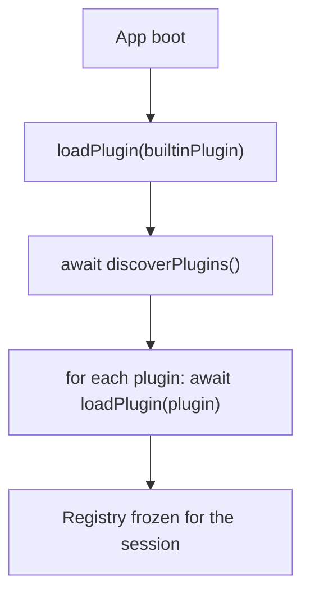

# Plugin authoring

*Public contract for external node packs that extend the Pascal editor.*

Applies to: anything that ships a `Plugin` for the editor to load.

This page documents the **contract**, not a loader implementation. The host call site (`discoverPlugins()`) is in place; turning it into a real network loader is a separate plan.

## Plugin shape

A plugin is a JS object exporting one symbol — the manifest:

```ts
import type { Plugin } from '@pascal-app/core'

export const myPlugin: Plugin = {
  id: 'acme:furniture-pack',
  apiVersion: 1,
  nodes: [
    couchDefinition,
    armchairDefinition,
    // ...
  ],
}
```

| Field | Required | Notes |
|---|---|---|
| `id` | yes | Globally unique. Use `vendor:pack-name` to avoid collisions. The host treats it as opaque. |
| `apiVersion` | yes | Currently `1`. The host throws on mismatch — bumping breaks plugins, intentionally. |
| `nodes` | optional | Array of `AnyNodeDefinition`. |

The standalone [`pascalorg/plugin-trees`](https://github.com/pascalorg/plugin-trees) repository is the worked example. Clone it as a starting point.

The same shape powers the built-in `pascal:core` plugin in `@pascal-app/nodes` — there's no "internal" plugin format. Whatever works for built-ins works for third parties.

## What a `NodeDefinition` can contribute

A plugin's `nodes` array is the only meaningful contribution point in v1. Each entry is a `NodeDefinition<S extends ZodObject>` that the registry stamps with `kind`, `schemaVersion`, `schema`, and any combination of:

- `defaults` — initial field values for new instances.
- `capabilities` — `selectable` / `duplicable` / `deletable` / `surfaces` / `relations` flags consumed by the framework.
- `parametrics` — auto-derived inspector UI shape (`fields` + optional `customPanel` escape hatch).
- `renderer` — custom 3D React component (GLB, drei, TSL — opt-out of `def.geometry`).
- `system` — per-frame work (animation, dirty-cascade, runtime state).
- `geometry` — pure `(node, ctx) => Object3D` for the generic `<GeometrySystem>`.
- `floorplan` — pure `(node, ctx) => FloorplanGeometry` for the 2D layer.
- `floorplanAffordances` / `floorplanMoveTarget` — 2D drag handlers.
- `tool` / `affordanceTools` — 3D placement + move tools (lazy components).
- `presentation` — palette / sidebar metadata (`label`, `icon`, `paletteSection`, etc.).
- `mcp` — MCP tool descriptions for AI consumers.
- `relations` / `computeLevelData` — sibling lookups + level-batch precompute.

See [`node-definitions.md`](node-definitions.md) for the three-checkbox composition model that ties these together.

## Standing on the ground (terrain)

The site carries a sculpted heightfield, so "the floor" is not the plane `y = 0`. A plugin kind that
hardcodes `0` as its base looks correct on a flat lot and buries itself in the hillside on a sculpted
one. There is no capability to declare and nothing to register — pick whichever of these matches how
your kind gets its Y, and terrain follows:

- **Your node stands on a surface** → declare `capabilities.floorPlaced` with a `footprint` (or
  `footprints` for a composite). `FloorElevationSystem` then lifts the registered mesh every frame,
  electing between overlapping slabs and the ground per footprint. This is the whole contract: a tree,
  a bench, a planter needs nothing else.
- **Your `def.geometry` builder bakes its own vertical origin** → read `ctx.levelBaseAt(x, z)`
  instead of writing `0`. It returns the ground at that level-local point (`0` when there is no
  terrain under the storey). Calling it also enrols your kind in terrain invalidation, so the builder
  re-runs when the ground moves; you don't wire a dirty rule. It is **absent for `def.floorplan`** —
  the plan view has no elevation — so a builder shared between 2D and 3D must use
  `ctx.levelBaseAt?.(x, z) ?? 0`.
- **You ship a collective `renderer`** (one component drawing many nodes — instanced meshes, a merged
  buffer) → you own each instance's Y. `FloorElevationSystem` writes to the node's *registered*
  object, which for a collective kind is the invisible selection proxy, not the instance, so a raw
  `node.position[1]` per instance ignores both slabs and terrain. Resolve through
  `getFloorStackedPosition({ node, nodes, position })` when writing each instance matrix, and commit
  the **base** position (`[x, 0, z]`) from your placement tool — the lift is presentation, never
  stored.

Sample the ground at the same XZ your geometry is anchored at. A handle, a snap guide and the mesh
that sample different points on a slope will visibly disagree. Background:
[`vertical-model.md`](vertical-model.md#inheriting-terrain-the-generic-seam).

## Importing host packages

A plugin imports from the published `@pascal-app/*` packages — same surface the built-ins use, peer-dependency-style:

```ts
// Schemas, types, registry types
import {
  type AnyNode,
  type NodeDefinition,
  type Plugin,
  z, // re-exported from zod for schema authoring
} from '@pascal-app/core'

// Viewer-side primitives (lazy: only inside renderers / systems)
import { useNodeEvents, NodeRenderer } from '@pascal-app/viewer'

// Editor-side primitives (lazy: only inside `tool` / `affordanceTools`)
import { useDragAction, EDITOR_LAYER } from '@pascal-app/editor'
```

The packages are **peer dependencies**, not normal dependencies — the host app owns the version. A plugin that pins its own copy of `@pascal-app/core` would create two registries and silently fail. (npm peer-dep resolution catches this at install time.)

## Following viewer appearance and performance preferences

A custom `renderer` owns its materials, so it must follow the same host appearance
axes as built-in nodes. Subscribe read-only to `useViewer` for `shading`, `textures`,
`colorPreset`, and `sceneTheme`; do not add plugin-specific quality toggles or copy
those values into scene data.

- **Colored + Rendered** keeps an imported model's authored materials.
- **Colored + Solid** uses `createDefaultMaterial(..., 'solid')` or another cached
  `MeshLambertNodeMaterial` variant. Preserve the authored albedo map, colour,
  transparency, and material slots, but omit PBR-only maps that defeat the cheaper
  Solid path.
- **Monochrome** uses `createSurfaceRoleMaterial(def.surfaceRole, colorPreset, side,
  sceneTheme)`. Imported props normally declare `surfaceRole: 'furnishing'`.
- Capture authored materials once when the model loads, cache variants per source
  material, swap only when preferences change, and restore before disposal. Never
  clone materials per frame, mutate loader-cached authored materials, or dispose a
  material returned from a host cache.

`shadows`, `edges`, and the Solid/Rendered post-processing cost are host-global.
Normal plugin geometry stays on `SCENE_LAYER`, so the light rig and depth/normal
pipeline include it automatically. Editor-only placement previews belong on
`OVERLAY_LAYER` / `EDITOR_LAYER`; that keeps ghosts out of shadow, SSGI, and ink-edge
passes. A plugin only needs to manage `castShadow` / `receiveShadow` for transparent
or overlay meshes rather than duplicating the host settings.

See [materials and themes](materials-and-themes.md#external-plugin-renderers) for the
material lifecycle pattern.

## Lifecycle



`loadPlugin` is **add-only** for v1. Hot-removing a kind would require tearing down every mounted instance in the scene — out of scope. Plugins are loaded once at boot.

`registerNode` throws on duplicate `kind`, so two plugins shipping a `kind: 'couch'` is a startup-time error, not a silent overwrite.

## Discovery: `setPluginDiscovery`

The host calls `discoverPlugins()` after the built-in plugin loads. The default implementation returns `[]`. Apps that ship external plugins replace it before the bootstrap module evaluates:

```ts
// In app boot, BEFORE `import './pascal-bootstrap'`
import { setPluginDiscovery } from '@pascal-app/core'
import { myPlugin } from '@acme/furniture-pack'

setPluginDiscovery(async () => {
  // Static import: bundled into the app.
  return [myPlugin]

  // Or fetch a manifest, dynamic-import each entry, etc.
  // const manifest = await fetch('/plugins.json').then(r => r.json())
  // return Promise.all(manifest.map(m => import(m.url).then(mod => mod.default)))
})
```

`setPluginDiscovery` is global. Calling it twice silently overwrites — order with the bootstrap import matters.

## Host panels and project installation

The core `Plugin` manifest remains renderer-agnostic. A plugin that also ships editor UI exports an `EditorHostPanel` separately:

```ts
import type { EditorHostPanel } from '@pascal-app/editor'

export const myHostPanel: EditorHostPanel = {
  id: 'acme:furniture-pack:catalog',
  pluginId: 'acme:furniture-pack',
  label: 'Furniture pack',
  description: 'A curated furniture catalog.',
  creator: {
    name: 'Acme',
    url: 'https://acme.example',
  },
  pluginUrl: 'https://github.com/acme/pascal-furniture-pack',
  icon: { kind: 'iconify', name: 'lucide:armchair' },
  component: () => import('./catalog-panel'),
}
```

The host registers that panel with `registerEditorHostPanel`. Registered plugins appear in the Plugins sidebar, while the scene graph's `installedPlugins: string[]` controls which plugin panels appear in that project's icon rail. `defaultInstalled: true` opts a first-party plugin into legacy and newly created projects; Nature uses this today.

Install/uninstall is a project-level visibility operation. Plugin code and node definitions stay loaded for the browser session because `loadPlugin` is add-only, but an uninstalled plugin's panel, placement UI, renderers, systems, and floor-plan output are disabled. Existing plugin nodes remain serialized in the scene graph and become visible again when the plugin is reinstalled; uninstall never deletes project data.

`creator` and `pluginUrl` are optional manager metadata. Selecting a plugin in the Plugins sidebar opens its detail page, where the host shows this metadata and the project install/uninstall control.

Host panels mount lazily inside an error boundary. Use host CSS variables, keep CSS scoped to the plugin, and do not write global styles.

## Versioning

`apiVersion: 1` covers the surface above. The host bumps the major when it removes or changes the shape of an existing field. New optional fields don't bump. The plan is to keep additions backwards-compatible as long as possible — the bump is the escape hatch, not the default.

A plugin's own data versioning is `schemaVersion` on each `NodeDefinition`. The host doesn't migrate; the plugin's `migrate(node, fromVersion)` (future) handles its own legacy persisted nodes.

## What's *not* a plugin contribution (yet)

- **Materials** — there's no `plugin.materials` slot. Use `createMaterial` from `@pascal-app/viewer` inside your `def.renderer` / `def.system`.
- **Floor-plan primitives** — the `FloorplanGeometry` union is host-owned. To draw something the union can't express, fall back to `def.renderer` and render through a different 2D mount (or open an issue).
- **Panels / sidebar UI in the core manifest** — host-specific. Export an `EditorHostPanel` separately for hosts that use `@pascal-app/editor`.
- **Stores** — plugins create their own Zustand stores; they don't extend `useScene`, `useEditor`, or `useViewer`. A renderer may subscribe read-only to exported host presentation state such as `useViewer` appearance axes, but must not treat host stores as plugin-owned state.
- **Routes / pages** — plugins are visualisation + interaction code, not full app surfaces. Hosting a settings page belongs to the app.

The boundary stays narrow on purpose so the contract is shippable. Each "not yet" item is a plan, not a "never."

## Testing your plugin

`@pascal-app/nodes` is the built-in reference implementation, and [`pascalorg/plugin-trees`](https://github.com/pascalorg/plugin-trees) is the standalone example. To test locally:

1. Build your plugin as a normal npm package with `@pascal-app/*` as peerDependencies.
2. In a host app that consumes your built-ins (`apps/editor` is the easiest target), wire `setPluginDiscovery` to return your plugin.
3. The dev-mode `[pascal:registry]` console log shows the loaded plugin id + node count — that's the verification anchor.

The host's own parity test (`packages/nodes/src/index.test.ts`) asserts every `AnyNode` discriminator has a registered kind. Plugin-contributed kinds don't participate in that test (they're not in `AnyNode`); add an equivalent test on your own side if you maintain a hand-typed union elsewhere.
